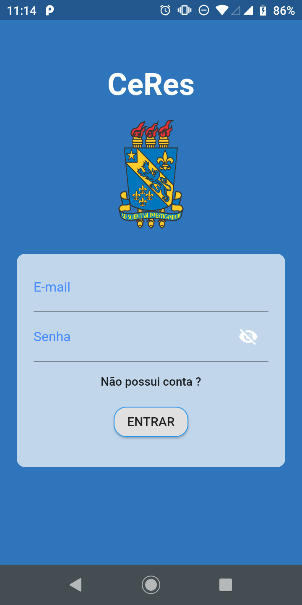
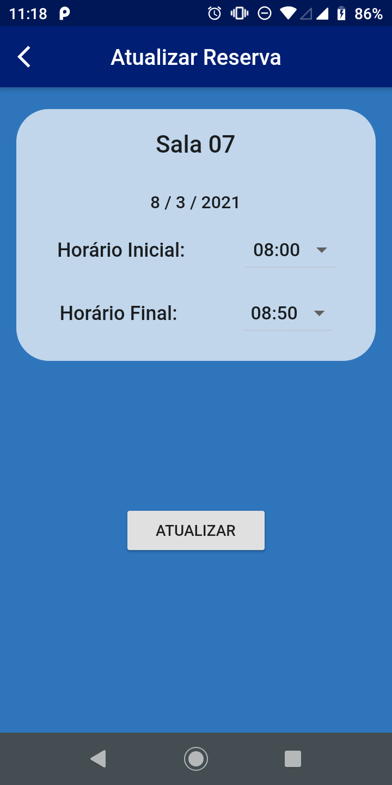

 
<strong> CeRes </strong>

## CERES - a Central de Reservas da UESPI Campus Piripiri

O sistema de reserva de material didático e de espaços do Campus Piripiri da UESPI, se chama *Cen*tral de *Res*ervas é desenvolvido pelo "Laboratório de Engenharia de Software", sob a liderança do Prof. Alcemir Santos.
 
## Documentação

#### Usuários
 - Usuário comum;
 - Administrado;

Usuário comum podera listar suas reservas e reservar através do aplicativo mobile.

Administrador pode gerenciar todos os recursos e todas as reservas. Esse usuário possui um painel administrativo no Site.

### Screenshots do Aplicativo 

<table>
    <thead>
        <tr>
            <th>
                Tela de Login
            </th>
            <th>
                Tela de Criar Conta
            </th>
            <th>
                Tela Inicial
            </th>
            <th>
                Tela de Recursos
            </th>
        </tr>
    </thead>
    <tbody>
        <tr>
            <th>
                
            </th>
            <th>
                
            </th>
            <th>
                
            </th>
            <th>
                
            </th>
        </tr>
    </tbody>
</table>

<table>
    <thead>
        <tr>
            <th>
                Tela de Reservar
            </th>
            <th>
                Tela de Lista Reservas
            </th>
            <th>
                Tela de Atualizar Reservas
            </th>
        </tr>
    </thead>
    <tbody>
        <tr>
            <th>
                
            </th>
            <th>
                
            </th>
            <th>
                
            </th>
        </tr>
    </tbody>
</table>

#### Animação do Aplicativo

    

### Tecnologias
#### Api
    - Django
    - Django-restframework
#### Mobile
    - Flutter

### Desenvolvedor
    - Gustavo Rodrigues Wanderley;
    - Allexandre Meneses de Melo;
