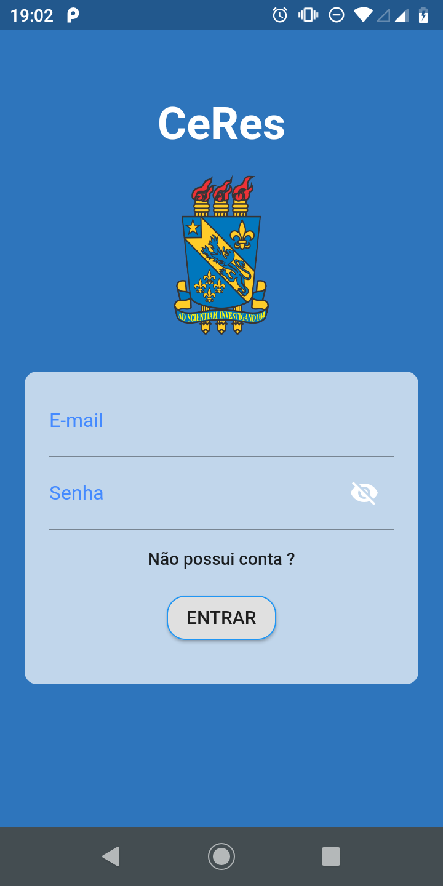
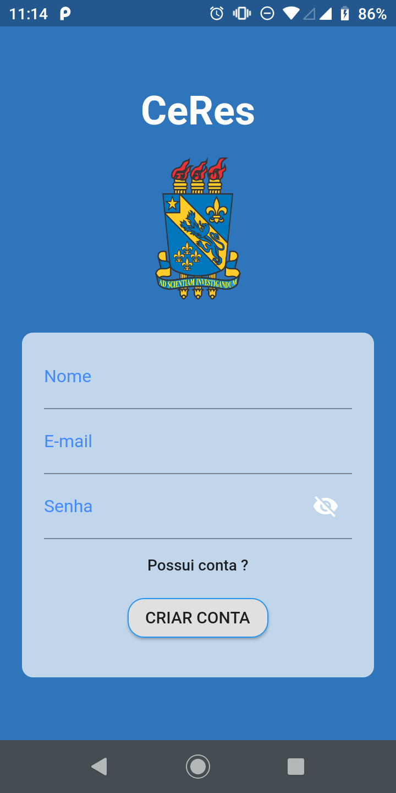
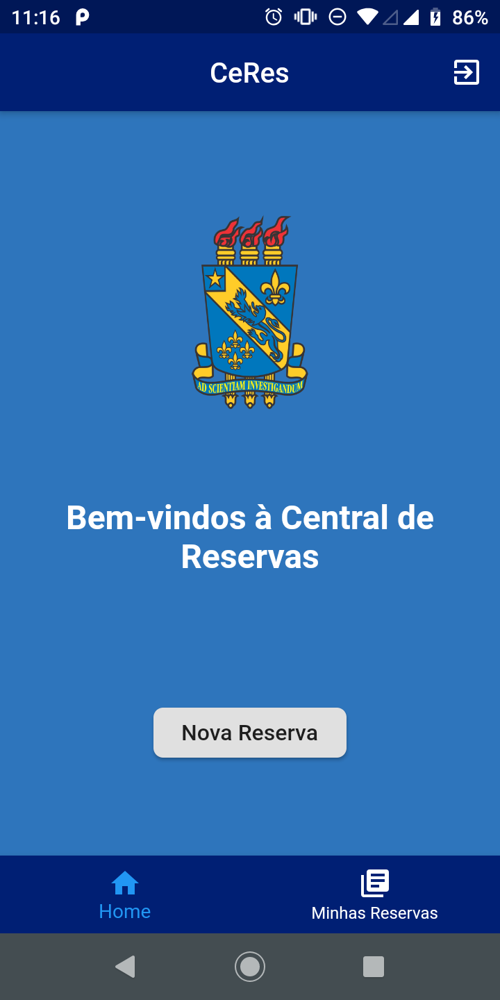
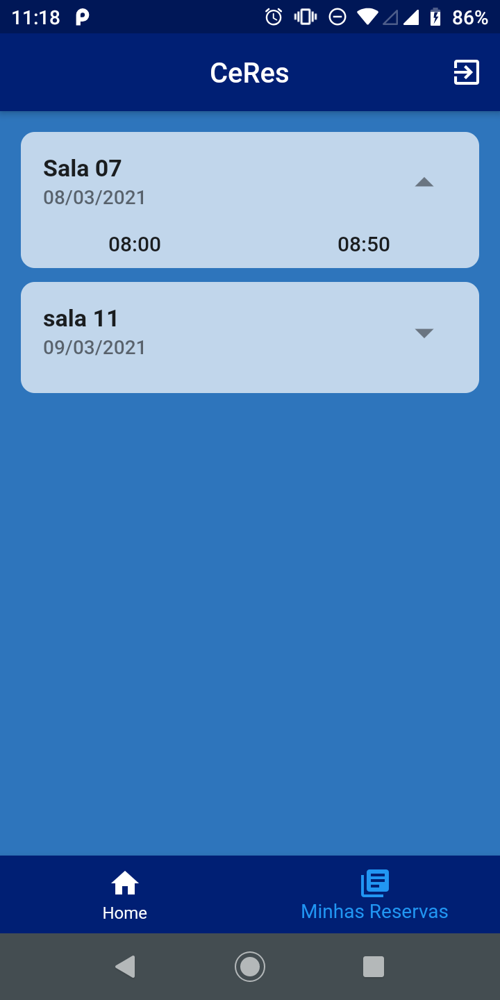
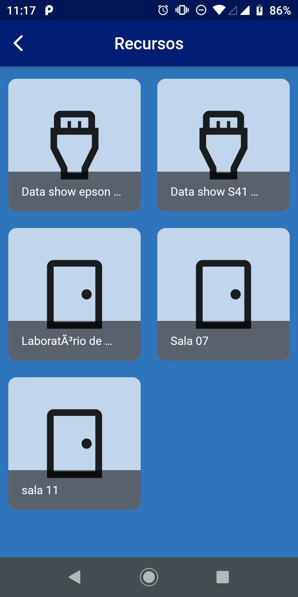
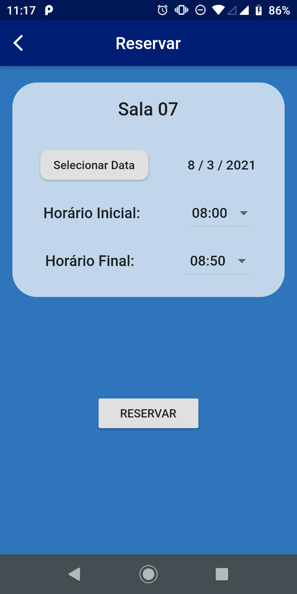

## CERES - a Central de Reservas da UESPI Campus Piripiri

O sistema de reserva de material didático e de espaços do Campus Piripiri da UESPI, se chama *Cen*tral de *Res*ervas é desenvolvido pelo "Laboratório de Engenharia de Software", sob a liderança do Prof. Alcemir Santos.
 
## Documentação

#### Usuários
 - Usuário comum;
 - Administrado;

Usuário comum podera listar suas reservas e reservar através do aplicativo mobile.

Administrador pode gerenciar todos os recursos e todas as reservas. Esse usuário possui um painel administrativo no Site.

### Aplicativo 
#### Tela de login

#### Tela de criar conta

#### Tela inicial

#### Tela de listar reservas

#### Tela de listar recursos

#### Tela reservar recurso

#### Animação do Aplicativo

</video>

### Tecnologias
#### Api
    - Django
    - Django-restframework
#### Mobile
    - Flutter

### Desenvolvedor
    - Gustavo Rodrigues Wanderley;
